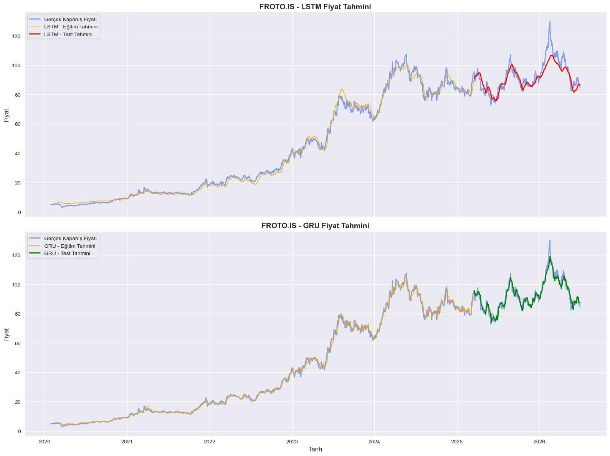
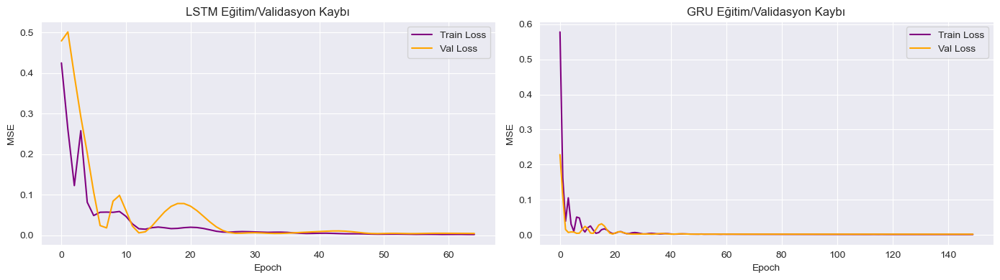

# Hisse Senedi Fiyat Tahmini: LSTM vs GRU (FROTO.IS)

PyTorch ile geliştirilmiş, Ford Otosan (BIST: **FROTO.IS**) hissesinin günlük kapanış
fiyatını çok değişkenli (multivariate) LSTM ve GRU modelleriyle tahmin eden bir zaman
serisi regresyon projesi. İki mimari, RMSE ve eğitim süresi açısından karşılaştırılıyor
ve sonuçlar bir **naive baseline** ile sağlamlık testinden geçiriliyor.

## İçindekiler
- [Proje Özeti](#proje-özeti)
- [Veri Seti](#veri-seti)
- [Kurulum](#kurulum)
- [Nasıl Çalıştırılır](#nasıl-çalıştırılır)
- [Yöntem](#yöntem)
- [Sonuçlar](#sonuçlar)
- [Sınırlılıklar](#sınırlılıklar)
- [Sonraki Adımlar](#sonraki-adımlar)

## Proje Özeti

| | |
|---|---|
| **Hedef** | Bir sonraki günün kapanış fiyatını tahmin etmek (regresyon) |
| **Girdi** | Son 20 günlük OHLCV + teknik indikatörler (12 özellik) |
| **Modeller** | LSTM ve GRU (aynı mimari, tek `nn.Module` sınıfı üzerinden) |
| **Metrik** | RMSE (gerçek fiyat cinsinden, TL) |
| **Baseline** | Naive tahmin: "yarının fiyatı = bugünün fiyatı" |

## Veri Seti

- **Kaynak:** [`yfinance`](https://pypi.org/project/yfinance/) üzerinden Yahoo Finance API
- **Hisse:** FROTO.IS (Ford Otosan, Borsa İstanbul)
- **Aralık:** 2020-01-01 – 2026-07-01 (indikatörler sonrası 1608 gözlem)
- **Özellikler (12):** Open, High, Low, Close, Volume, SMA_20, EMA_20, Upper_Band,
  Lower_Band, MACD, MACD_Signal, RSI

Veri, repo içinde saklanmıyor — notebook her çalıştırıldığında `yfinance` ile canlı
olarak indiriliyor. Farklı bir hisse/tarih aralığı denemek için notebook'taki `TICKER`,
`start_date`, `end_date` değişkenlerini değiştirmeniz yeterli.

## Kurulum

```bash
git clone <repo-url>
cd <repo-adı>
python -m venv venv
source venv/bin/activate   # Windows: venv\Scripts\activate
pip install -r requirements.txt
```

## Nasıl Çalıştırılır

```bash
jupyter notebook notebooks/Stock_Prediction_LSTM_GRU.ipynb
```

Notebook'u baştan sona (Run All) çalıştırmanız yeterli. Çalıştırma sonunda üretilen
`lstm_model.pth`, `gru_model.pth` ve `scalers.pkl` dosyaları, eğitilmiş modelleri
yeniden eğitmeden yüklemek için kullanılabilir.

## Yöntem

1. **Veri toplama & özellik mühendisliği** — `yfinance` ile OHLCV indirilir; SMA, EMA,
   Bollinger Bantları, MACD ve RSI eklenir.
2. **Ölçekleme** — `MinMaxScaler(-1, 1)`, veri sızıntısını önlemek için yalnızca train
   bölümüne fit edilir.
3. **Sliding window** — 20 günlük pencerelerden 21. günün fiyatı tahmin edilecek şekilde
   diziler oluşturulur (train/val/test zaman sırası korunarak ayrılır: %68/%12/%20).
4. **Model** — 2 katmanlı LSTM/GRU (`hidden_dim=64`, `dropout=0.2`) + doğrusal çıktı katmanı.
5. **Eğitim** — Adam optimizer, MSE loss, `patience=15` ile early stopping (en fazla 150 epoch).
6. **Değerlendirme** — Train/val/test RMSE + naive baseline karşılaştırması.

## Sonuçlar

| Model | Test RMSE | Val RMSE | Eğitim Süresi (sn) |
|---|---|---|---|
| LSTM | 5.083 | 3.239 | 6.38 |
| **GRU** | **2.690** | 2.227 | 22.29 |
| Naive Baseline | 2.050 | – | – |

**GRU, LSTM'i açıkça geçiyor** (test RMSE %47 daha düşük). Ancak **hiçbir model naive
baseline'ı geçemiyor** — bu, modellerin öğrendiği şeyin büyük ölçüde "bir önceki günü
tekrar et" stratejisine yakın olabileceğini gösteriyor. Bu deneyde GRU, literatürde sık
belirtilenin aksine LSTM'den **daha yavaş** eğitildi (early stopping'in LSTM'i çok daha
erken durdurmasından kaynaklanıyor olabilir).

### Gerçek vs Tahmin Fiyatları



### Eğitim / Validasyon Kayıp Eğrileri



Notebook, `Run All` ile her çalıştırıldığında bu iki görseli otomatik olarak
`results/` klasörüne kaydeder (`plt.savefig(...)`).

## Sınırlılıklar

Hisse senedi fiyat tahmini, kısa vadeli fiyat hareketlerinin büyük ölçüde rastgele
yürüyüşe (random walk) yakın davranması nedeniyle son derece zor bir problemdir. Bu
projedeki modellerin naive baseline'ı geçememesi, kurulumdan çok problemin doğasındaki
bir sınırlamayı yansıtıyor olabilir. ML'in tahmin gücünü abartmamak için eleştirel bir
bakış açısı önerilir (bkz. Narayanan & Kapoor, *AI Snake Oil*).

## Sonraki Adımlar

- Fiyat yerine getiri (return) veya yön (yukarı/aşağı) tahmini denemek
- Ek özellikler (haber/duygu verisi, makro göstergeler)
- Sistematik hiperparametre araması + zaman serisi çapraz doğrulama
- Alternatif mimariler (TCN, Transformer tabanlı zaman serisi modelleri) ile karşılaştırma

## Proje Yapısı

```
.
├── notebooks/
│   └── Stock_Prediction_LSTM_GRU.ipynb
├── results/
│   ├── actual_vs_predicted.png
│   └── loss_curves.png
├── requirements.txt
├── .gitignore
└── README.md
```
